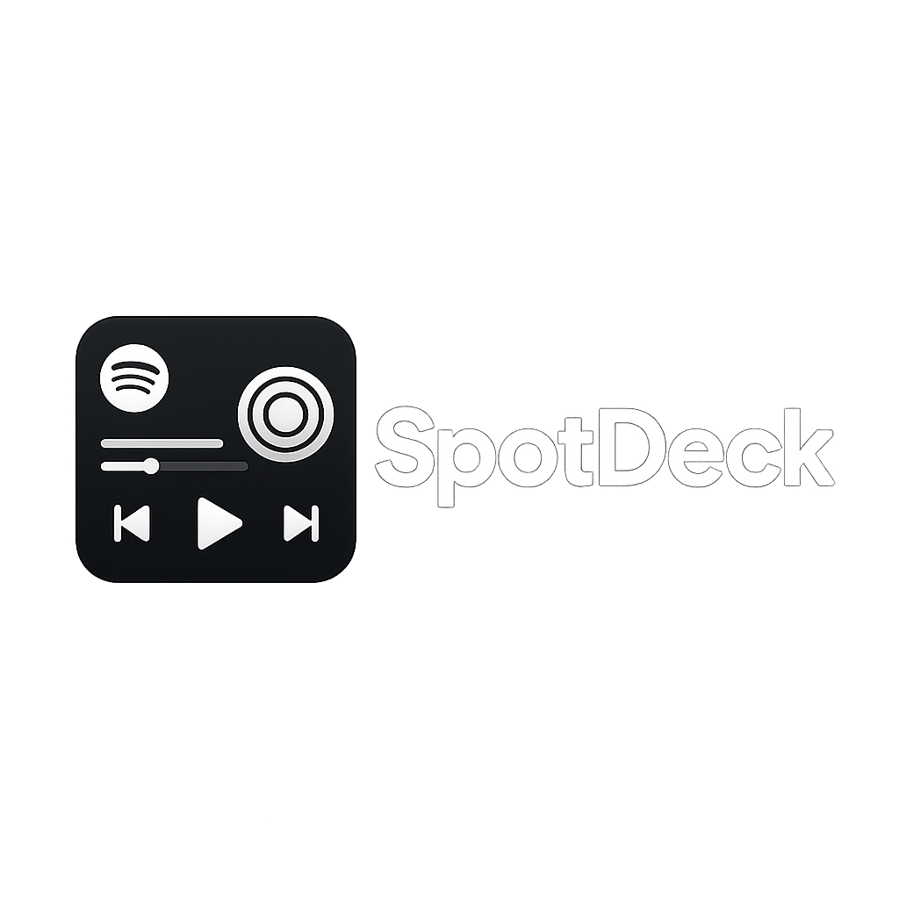
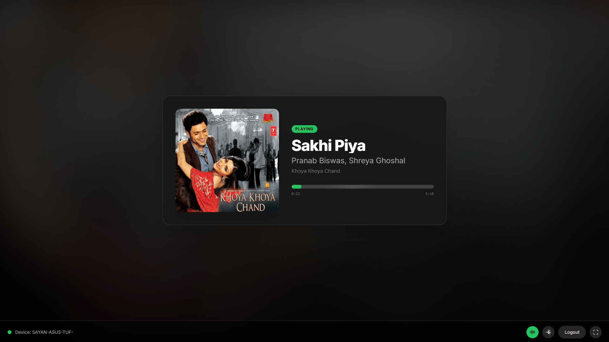
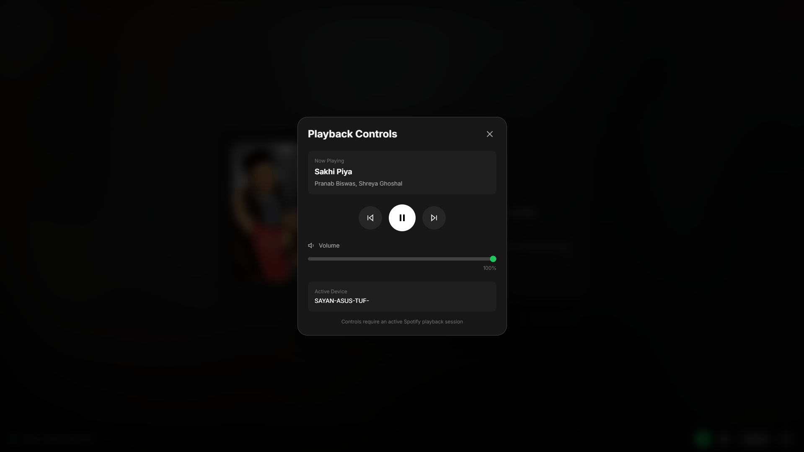

<p align="left">
  
</p>

# 🎵 SpotDeck: Spotify Now Playing Dashboard

**SpotDeck** is a sleek, animated "Now Playing" dashboard inspired by the concept of a dedicated media display (like the discontinued Spotify Car Thing). It transforms any spare device—a tablet, a secondary monitor, or a spare phone—into a beautiful, interactive music display with real-time album art ambience and playback controls.

## ✨ Features

  * **Real-Time Playback Info:** Displays the current track's title, artist, album, and progress.
  * **Animated Visuals:** Smooth crossfade transitions, progress bar shimmer, and a dynamic, color-matched ambient background and album art glow based on the current track's album art.
  * **Full Playback Controls:** Integrated buttons for Play/Pause, Skip Next, Skip Previous, and Volume Control (requires Spotify Premium and an active device).
  * **Device Status:** Shows the connected device and its online/offline status.
  * **Fullscreen Mode:** Dedicated fullscreen button and keyboard shortcut (`F` or `f`).
  * **Keyboard Shortcuts:** Control playback with the spacebar, and toggle fullscreen with `F`.
  * **Secure PKCE Authentication:** Uses modern, secure Proof Key for Code Exchange (PKCE) for Spotify authorization without exposing a client secret.

## 👀 Preview





## 🛠️ Setup Instructions (GitHub Pages & Private Repo)

To host your SpotDeck securely using GitHub Pages from a private repository, you need to set up a Spotify Developer Application and configure the deployment.

### Step 1: Create a Spotify Developer Application

1.  Go to the [Spotify Developer Dashboard](https://developer.spotify.com/dashboard/).
2.  Click **Create app**.
3.  Fill in the App Name (e.g., `SpotDeck`), Description, and check the box for `Web API`.
4.  Click **Create**.
5.  In your new app's settings, find the **Client ID** and keep it handy.
6.  Click **Edit Settings**.
7.  Under **Redirect URIs**, add the following URL. This URL is crucial and must exactly match the path of your GitHub Pages site:
    ```
    https://<YOUR-GITHUB-USERNAME>.github.io/<YOUR-REPO-NAME>/
    ```
    *Example: `https://johndoe.github.io/spotdeck-display/`*
8.  Click **Add** and then **Save**.

### Step 2: Configure Your GitHub Repository

1.  **Create a New Private Repository** on GitHub (e.g., `spotdeck-display`).
2.  **Upload the `index.html` file** (the provided file) to the root of this new repository.

### Step 3: Insert Your Client ID

1.  Open the `index.html` file in your GitHub repository editor (or locally).
2.  Find the line near the top of the `<script>` tag:

    ```
    const SPOTIFY_CLIENT_ID = "YOUR_SPOTIFY_CLIENT_ID_HERE";
    ```
    
4.  **Replace** `"YOUR_SPOTIFY_CLIENT_ID_HERE"` with the actual **Client ID** you obtained in Step 1.
5.  **Commit** the changes to your repository.

### Step 4: Configure GitHub Pages Deployment

To enable GitHub Pages on a **private** repository, you must use a specific setup, typically deploying from the `main` branch.

1.  In your GitHub repository, go to **Settings**.
2.  In the left sidebar, click **Pages**.
3.  Under **Build and deployment**, select:
      * **Source:** **Deploy from a branch**
      * **Branch:** Select the **`main`** branch and the **`/ (root)`** folder.
4.  Click **Save**.
5.  GitHub will now deploy your site. This may take a few minutes. Once deployed, the URL will be displayed on this page (it will be the same URL you entered as the Redirect URI in Step 1).

### Step 5: Final Authorization

1.  Navigate to your deployed GitHub Pages URL (e.g., `https://<YOUR-GITHUB-USERNAME>.github.io/<YOUR-REPO-NAME>/`).
2.  Click the **Connect Spotify** button.
3.  You will be redirected to the Spotify login page to authorize the application.
4.  After authorization, you will be redirected back to your SpotDeck display, and it will begin showing your current playback status.

## 💻 Keyboard Shortcuts

| Key | Action | Notes |
| :--- | :--- | :--- |
| **Space** | Play/Pause | Only works when the Settings Modal is closed. |
| **F** / **f** | Toggle Fullscreen | |
| **Escape** | Close Settings Modal | |
| **V** / **v** | Toggle Visualizer | |

## ⚠️ Requirements

  * **Spotify Premium:** Playback control functions (Play/Pause, Skip, Volume) require a **Spotify Premium** subscription due to Spotify API restrictions.
  * **Active Device:** You must have Spotify actively playing on another device (like your phone or computer) for SpotDeck to display playback data and allow controls.
